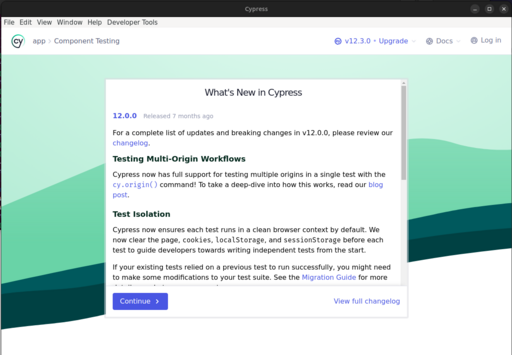
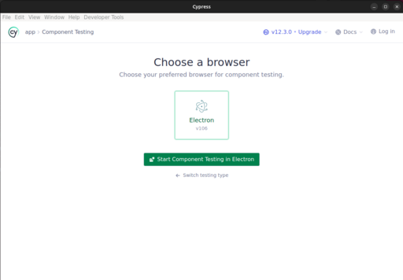
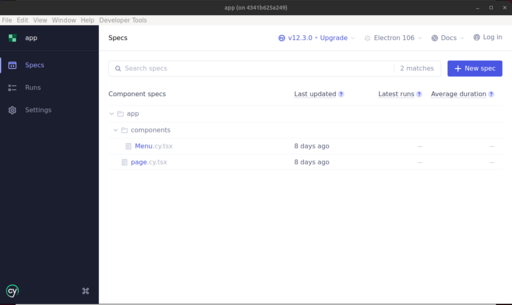
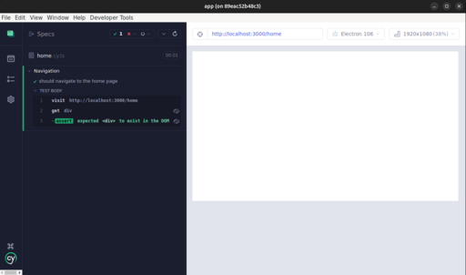

# Getting Started with NextJS and TDD

Test Driven Development (TDD) is a software development approach where tests are written before the implementation of the code. It follows a cycle of "Red-Green-Refactor" to guide the development process.

This template project aims at:
- providing a starting point to create a NextJS application with support for
  - Components testing
  - Unit testing
  - End-To-End testing
  We are using [Cypress](https://cypress.io). With Cypress, you can easily create tests for your modern web applications, debug them visually, and automatically run them in your continuous integration builds.
- containerized environment, with deployment to kubernetes.

# Quick start

Clone this repo (or use GitHub UI to create a new one using this repo as template).

## Pre-requisites

All you need is `docker` and `docker-compose` installed. Then run the command in the root directoy of the project.
```
make setup
```

### Optional

This project was created in VS Code. The following extensions are used:
- Docker (`ms-azuretools.vscode-docker`)
- EditorConfig (`editorconfig.editorconfig`)
- Prettier - Code Formatter (`esbenp.prettier-vscode`)
- Tailwind CSS IntelliSense (`bradlc.vscode-tailwindcss`)
- YAML (`redhat.vscode-yaml`)

## Let's play

To run all the tests, you can run the command:
```
make test
```
which opens the following window


Then press the `Continue` button


And finally click on the `Menu.cy.tsx` or `page.cy.tsx` test to run it.



Next let's run the End to end tests:
```
make e2e
```
which opens the following window


Then press the `Continue` button


And finally click on the `home.cy.ts` test to run it.


The component tests will look like below:


You can then start the application. Run the command:
```
make dev
```
And then open your browser on http://localhost:3000. It supports hot-reload so you can work smoothly.
